# Mr. RIGANTI lamp

**[RIGANTI](https://www.riganti.cz/en) is a software consulting company** located in Prague, Czech Republic. We help our customers with digital transformation and innovation.

This repo contains everything you need to make your own **3D printed Mr. RIGANTI lamp**.

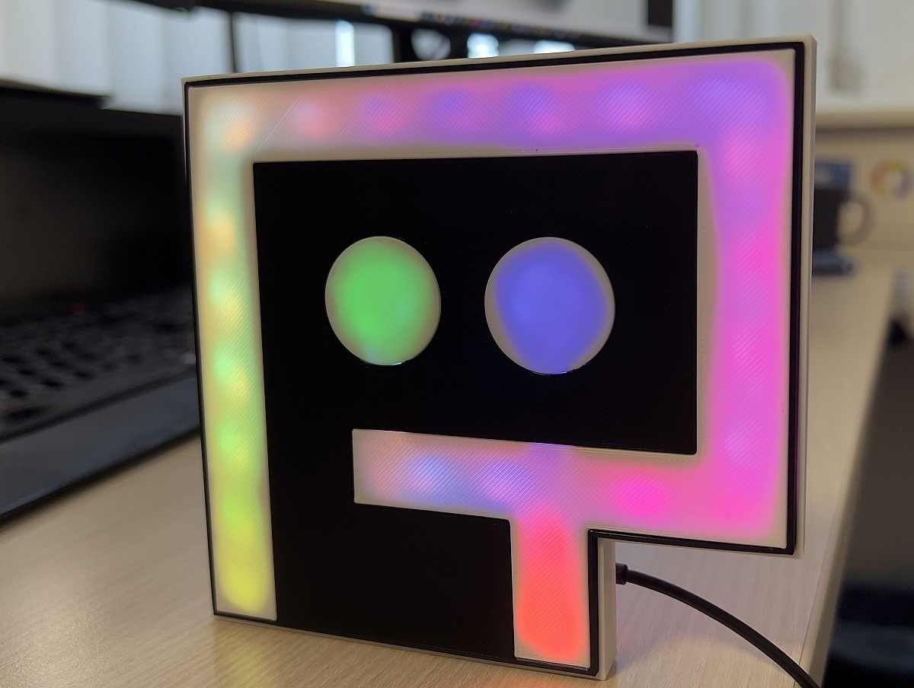

## Material requirements

* **3D printer**
* **Black filament**
* **White filament**
* **WS2812B LED strip** (60 LED per meter, individually addressed LEDs), for example [here](https://www.amazon.de/dp/B0BTVBTHQ5?psc=1&ref=ppx_yo2ov_dt_b_product_details)
* **ESP8266 D1 Mini NodeMcu**, for example [here](https://www.amazon.de/-/cs/dp/B0CTB8XMY3/ref=sr_1_2?crid=1VV9ARST3JTD9&dib=eyJ2IjoiMSJ9.9TCWepwuhCle3Nm9t-G-0RWxSXBgqUNLOhrT0RzG-_5UB-G-FlGxGMatr1FdRnnQsOb3m69n5gMvXBjjKu5qOJivy8YsqWHC8hkwmMckD2O-DoY4S0v2OLPMTlwigtA5UBD3VWMP2aDymV__Moq8337vFb2zlA7z5QYyRC_V47eMtflEiZuvpKMGzuDwDK2E5KRHgdVemahDIb9Rm7K6e6CeHjkP6IlIpA2Hn1R54xs.yyke_-v2GFdZoPwvY7BxVoWYuQdjISVsx0N7vJioFsY&dib_tag=se&keywords=D1+Mini+ESP8266&qid=1720004099&sprefix=d1+mini+esp8266%2Caps%2C121&sr=8-2)
* **MicroUSB cable**

## Step 1: Print the parts

* [Part 0](parts/part0.stl) shall be printed with black filament.
* [Part 1](parts/part1.stl), [Part 2](parts/part2.stl) and [Part 3](parts/part3.stl) shall be printed with white filament.

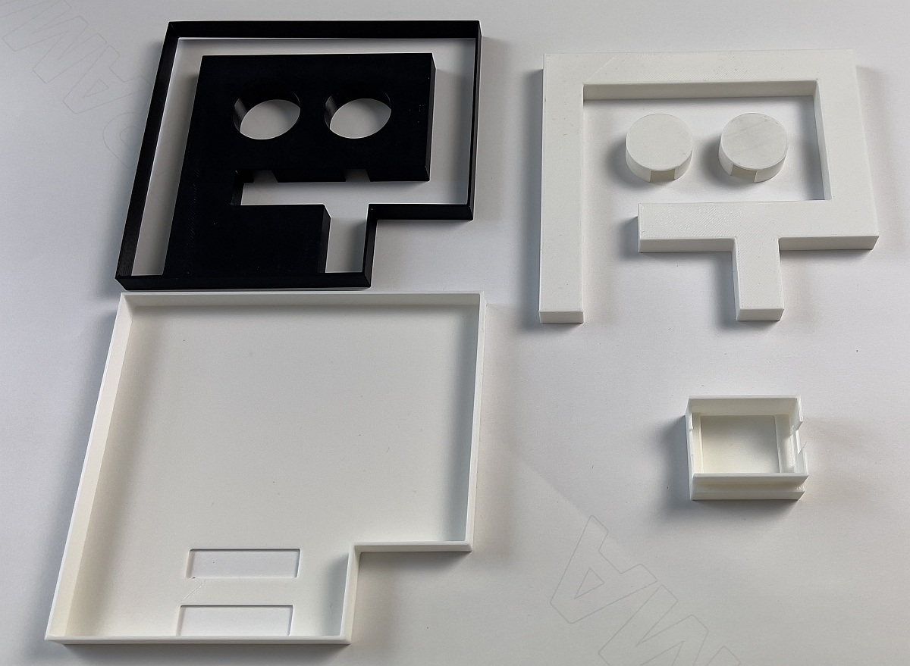

If you need to fine-tune or edit the parts, use the [OpenSCAD source file](src/mr-riganti.scad) to adjust the models. 

## Step 2: Insert Part 1 in Part 0

Insert the white logo shape of Mr. RIGANTI (including the eyes) in the black frame.

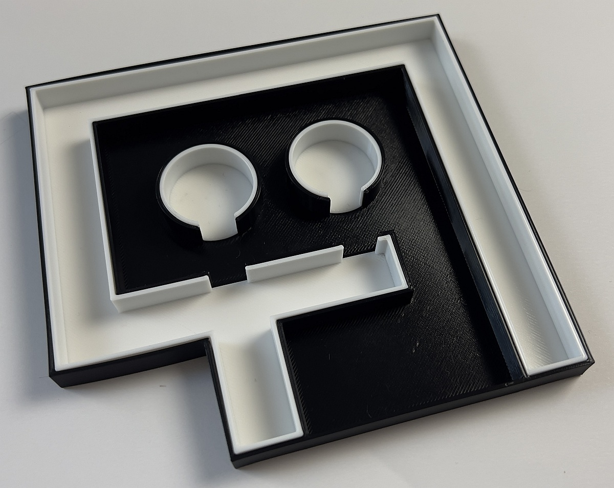

## Step 3: Connect the LED strip with the WS2812B

I used three wires and soldered them to the LED strip and WS2812B. 

* Red wire goes to +5V.
* White wire goes to GND.
* Green wire goes to D4 on WS2812B and DIN wire on the LED strip.

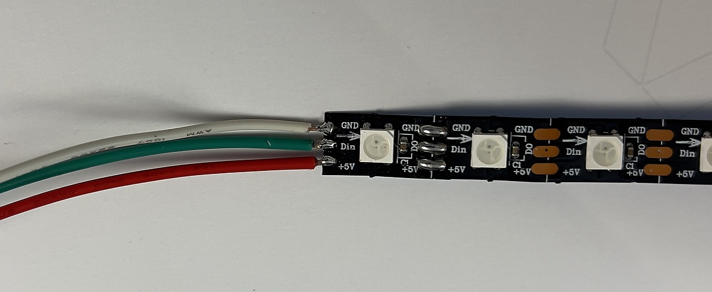

When soldering the wires, make sure the MicroUSB connector is facing down and the wires are on the upper side.

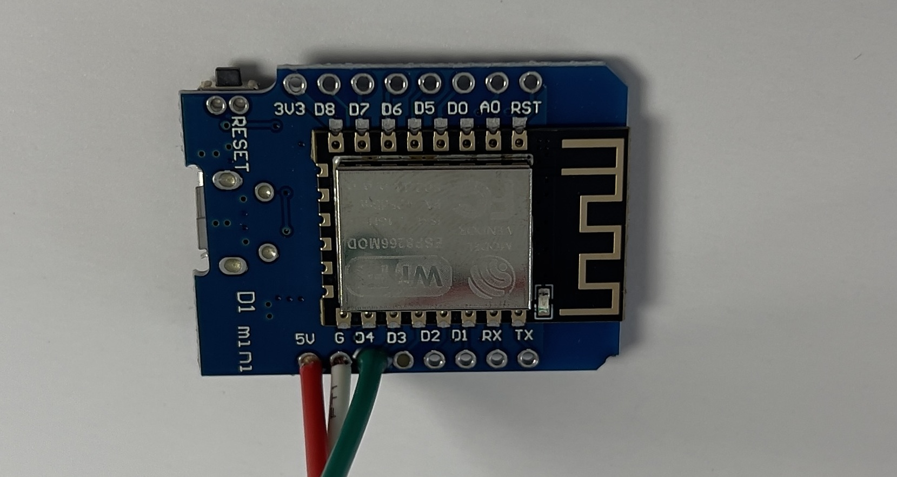

## Step 4: Glue the LED strip into the white logo frame

Glue the LED strip around the inner side of the white logo. You will need to cut it at one of the designated splitting spot. 

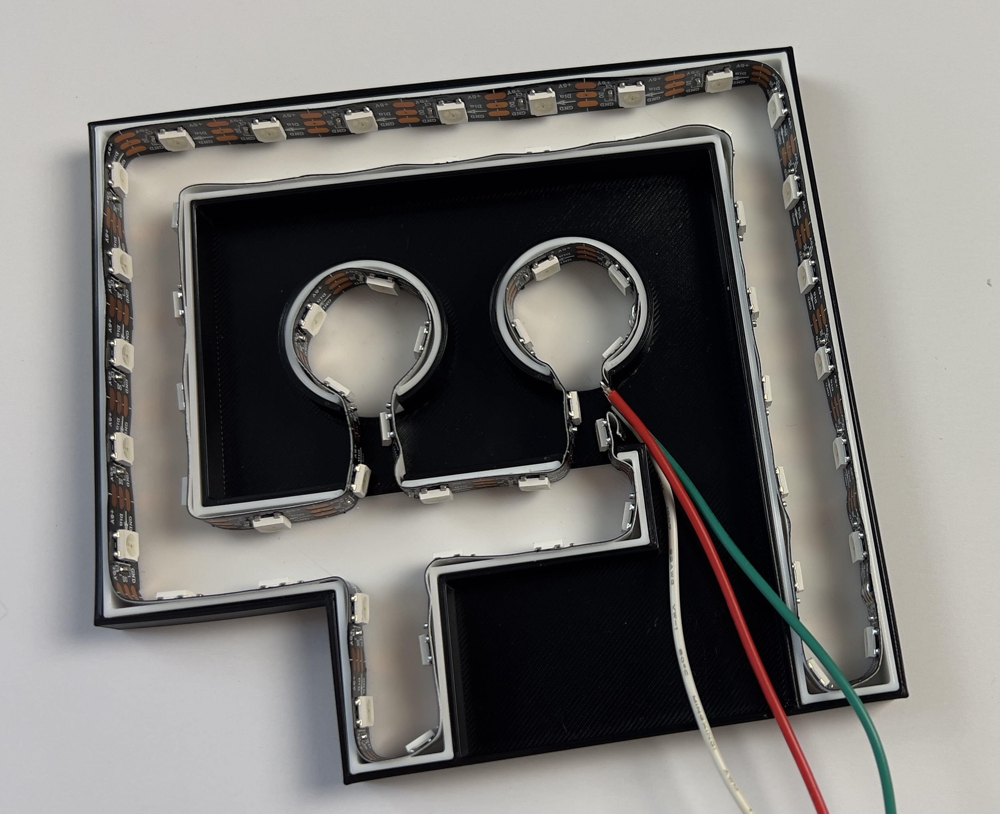

Count the LEDs you used - you will need it in the next step. My version required 59 LEDs.

## Step 5: Assemble Mr. RIGANTI

Assemble the parts together as shown in the pictures.

First, insert the WS2812B through the top hole in Part 3.

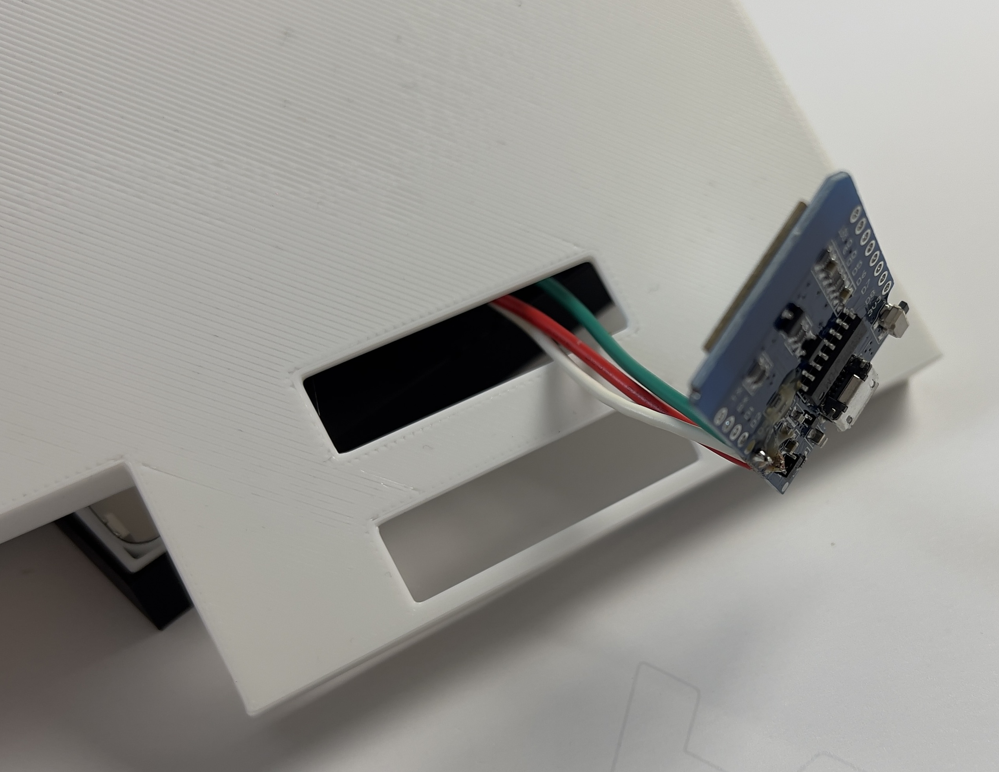

Second, place WS2812B in Part 4 (MicroUSB connector facing down) and insert it into Part 3. The bottom edge of the logo shall be aligned.

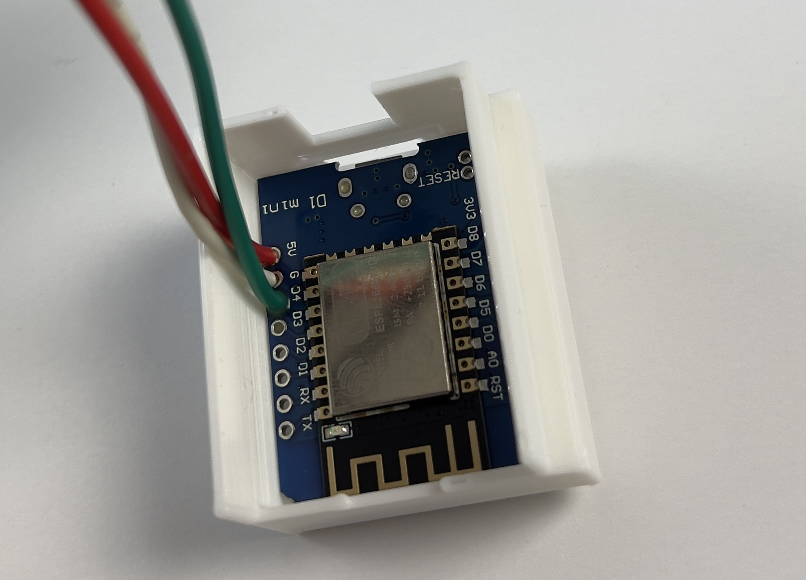

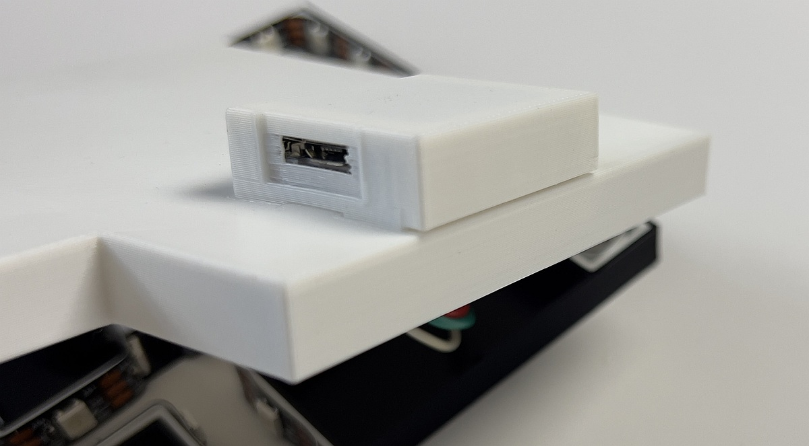

Last, insert the remaining parts inside each other. Make sure the wires do not obstruct the way between the parts.

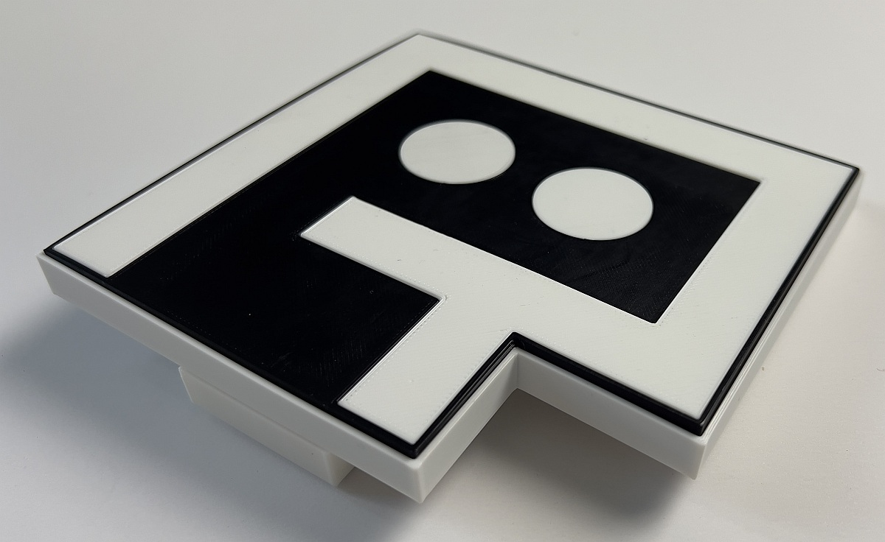

> Please note that the models do not have any gaps. Sometimes, you may need to use force when assembling the parts together, but you should not need to use glue.

## Step 6: Configure the controller

Connect the device using Micro USB cable to the PC.

Install the corresponding [drivers](https://github.com/nodemcu/nodemcu-devkit/tree/master/Drivers)

Visit [https://install.wled.me](https://install.wled.me)], click **Install** and flash the firmware to the device.

Then, open the settings and enter the number of LEDs (59 in my case) in the **LED preferences** tab.

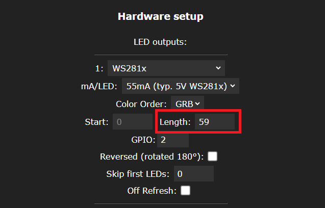

Configure the LED behavior as you wish.

> To use the solid RIGANTI green color, use the following link:
>
>     http://CONTROLLER_IP_ADDRESS/win&A=128&FX=0&R=57&G=229&B=142

If you want the device to remember the last settings when disconnected from power, create a preset and set it to apply on boot.

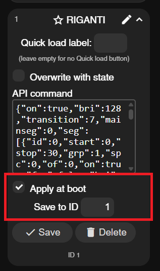

## Acknowledgments

This project is inspired by [Martin Woodward's Octolamp](https://github.com/martinwoodward/octolamp).

## Conclusion

This is the first version of the model. We are sure it will be improved over time. 

Feel free to send us any suggestions or improvements.

Happy hacking!